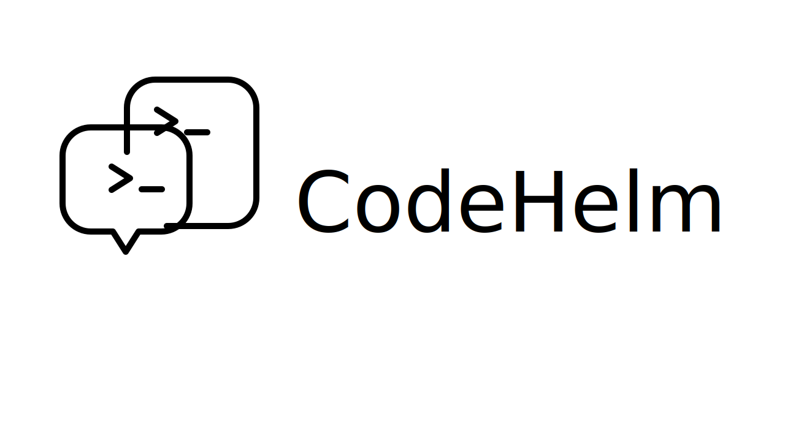

<div align="center">



<h2>Control your local Codex sessions remotely through Discord on your phone or browser.</h2>

[](https://www.npmjs.com/package/code-helm)
[](https://bun.sh)
[](https://www.typescriptlang.org/)
[](https://discord.com/developers/docs/intro)

<br />

[Demo](#demo) · [Quick Start](#quick-start) · [Workflow](#workflow) · [Discord Setup](docs/discord-bot-setup.md) · [Development](#development)

</div>

## ⚡ Overview

CodeHelm runs a local daemon, manages a local Codex App Server, and turns a
Discord channel into a control surface for Codex sessions. You can set a
workdir, start or resume a session, approve requests, interrupt a running turn,
and follow progress in one Discord thread instead of bouncing between tools.

> You only need to: start CodeHelm locally, connect Codex to the printed remote
> address, and use the configured Discord channel.
>
> CodeHelm will return: a managed Discord thread attached to a real Codex
> session, with transcript updates, approval controls, and final output in one
> place.

## Demo

<video src="docs/demo/04-23-code-helm.mp4" controls preload="metadata"></video>

## Workflow

1. **Start the local daemon**: CodeHelm connects to Discord and starts a managed
   Codex App Server on loopback.
2. **Connect Codex**: run `codex --remote <ws-url>` with the address printed by
   `code-helm start`.
3. **Choose a workdir**: use `/workdir` in the configured Discord control
   channel.
4. **Create or resume a session**: use `/session-new` or `/session-resume`.
5. **Work inside the managed thread**: send follow-up messages, approve
   requests, inspect status, interrupt turns, and read the final answer.

Each managed Discord thread stays attached to one Codex session, so you can
leave and come back later without starting from scratch.

## Quick Start

### Option 1: Global Package Installation (Recommended)

#### Prerequisites

| Tool or setup   | Requirement                                      | Check                                            |
| --------------- | ------------------------------------------------ | ------------------------------------------------ |
| Bun             | Installed on the machine running CodeHelm        | `bun --version`                                  |
| Codex           | Installed on the same machine                    | `codex --version`                                |
| Discord bot     | Bot token, target server, control channel        | [Discord setup guide](docs/discord-bot-setup.md) |
| Discord channel | Text or announcement channel with public threads | Check channel permissions                        |
| Bot intent      | `Message Content Intent` enabled                 | Discord Developer Portal                         |

#### 1. Install CodeHelm

Choose one install method:

```bash
npm install -g code-helm
```

```bash
bun add -g code-helm
```

Bun is still required at runtime even if you install the package with `npm`.

> [!IMPORTANT]
> CodeHelm stores its state locally and does not require a hosted CodeHelm
> control plane.
>
> It writes local files under:
>
> - `~/.config/code-helm/config.toml`
> - `~/.config/code-helm/secrets.toml`
> - `~/.local/share/code-helm/codehelm.sqlite`
> - `~/.local/state/code-helm/`
> - `~/.codehelm/workdir`
>
> CodeHelm connects to Discord APIs for bot messages, slash commands, threads,
> and approvals. `code-helm check` and `code-helm update` query npm. To inspect
> the daemon, use `code-helm status`. To stop it, use `code-helm stop`. To
> remove local state, use `code-helm uninstall`.

#### 2. Onboard Discord

```bash
code-helm onboard
```

The guided setup asks for:

- your Discord bot token
- the target guild
- the control channel

#### 3. Start CodeHelm

Foreground:

```bash
code-helm start
```

Background:

```bash
code-helm start --daemon
```

#### 4. Connect Codex

Use the address printed by `code-helm start`:

```bash
codex --remote <ws-url>
```

If you want Codex to start in your current shell directory:

```bash
codex -C "$(pwd)" --remote <ws-url>
```

#### 5. Control Sessions From Discord

Control-channel commands:

| Command           | Purpose                                   |
| ----------------- | ----------------------------------------- |
| `/workdir`        | Set the current local workdir             |
| `/session-new`    | Start a fresh Codex session               |
| `/session-resume` | Reattach an existing Codex session        |
| `/session-close`  | Close the current managed session thread  |
| `/session-sync`   | Recover a degraded managed session thread |

Managed-thread commands and actions:

| Command or action            | Purpose                                 |
| ---------------------------- | --------------------------------------- |
| Send a normal thread message | Continue the Codex conversation         |
| Approval buttons             | Approve or decline Codex requests       |
| `/status`                    | Show the current managed session status |
| `/interrupt`                 | Interrupt the current Codex turn        |

### Option 2: Local Repository Development

```bash
bun install
bun run dev
```

Development checks:

```bash
bun test
bun run typecheck
```

Useful development commands:

```bash
bun run migrate
```

## Operational Commands

```bash
code-helm status
code-helm stop
code-helm check
code-helm update
code-helm version
```

<details>
<summary><b>More Operations</b></summary>

### Autostart

On macOS, CodeHelm can install a LaunchAgent that starts the daemon at login:

```bash
code-helm autostart enable
```

To remove it:

```bash
code-helm autostart disable
```

Unsupported platforms return an explicit unsupported result.

### Uninstall

To remove the local CodeHelm installation state:

```bash
code-helm uninstall
```

That command stops the background daemon if one is running, disables autostart
when supported, and removes the local config, secrets, database, and
runtime-state files.

To remove the global package too, use the same package manager you used to
install it:

```bash
npm uninstall -g code-helm
```

```bash
bun remove -g code-helm
```

</details>

## Development

For local repository development:

```bash
bun install
bun test
bun run typecheck
```

Useful development commands:

```bash
bun run dev
bun run migrate
```
