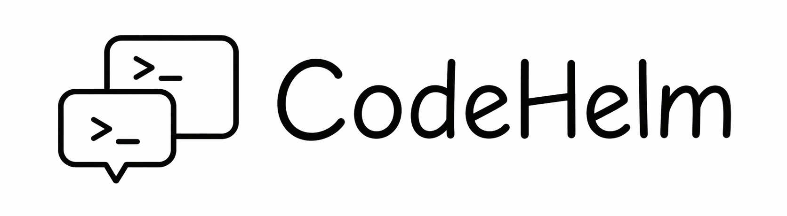
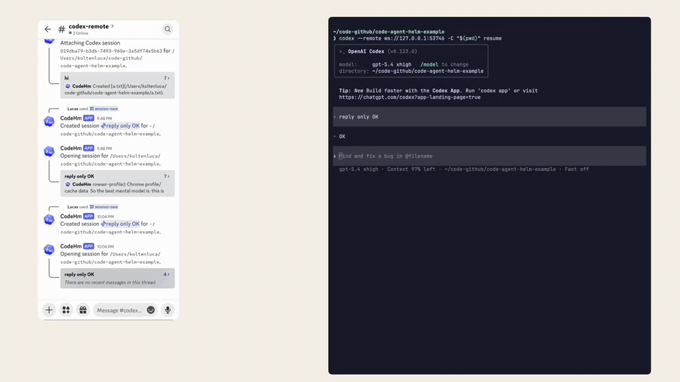

<div align="center">



<h2>本地运行 Codex，从 Discord 远程控制。</h2>

<p><strong>在手机上审批、恢复、中断并跟进 AI coding 任务。</strong></p>

<p>
CodeHelm 可以让你在 Discord thread 里创建、恢复、审批、中断并跟进本地 Codex
会话。
</p>

[](https://www.npmjs.com/package/code-helm)
[](https://bun.sh)
[](https://www.typescriptlang.org/)
[](https://discord.com/developers/docs/intro)

<br />

[English](README.md) · [中文](README.zh-CN.md)

<br />

[演示](#演示) · [快速开始](#快速开始) · [工作流](#工作流) · [Discord 设置](docs/discord-bot-setup.md) · [开发](#开发)

</div>

## ⚡ 概览

CodeHelm 会在本机运行一个 daemon，管理本地 Codex App Server，并把一个
Discord 频道变成 Codex 会话的控制面板。你可以设置工作目录、创建或恢复会话、
审批请求、中断正在运行的回合，并在同一个 Discord thread 里跟进进度，而不用在
多个工具之间来回切换。

适合这些场景：

- 离开终端时，用手机审批 Codex 操作
- 让团队在 Discord 里一起看 AI coding session
- 长任务不用一直守着 terminal，回来还能继续

> 你只需要：在本机启动 CodeHelm，把 Codex 连接到它打印出来的 remote 地址，
> 然后使用配置好的 Discord 频道。
>
> CodeHelm 会给你：一个绑定真实 Codex 会话的 Discord thread，里面包含转录更新、
> 审批按钮和最终输出。

## 演示



## 工作流

1. **启动本地 daemon**：CodeHelm 连接 Discord，并在 loopback 上启动托管的
   Codex App Server。
2. **连接 Codex**：使用 `code-helm start` 打印的地址运行
   `codex --remote <ws-url>`。
3. **选择工作目录**：在配置好的 Discord 控制频道里使用 `/workdir`。
4. **创建或恢复会话**：使用 `/session-new` 或 `/session-resume`。
5. **在托管 thread 里工作**：继续发送消息、审批请求、查看状态、中断当前回合，
   并读取最终回答。

每个托管的 Discord thread 都会绑定到一个 Codex 会话，所以你可以离开一会儿，
之后再回来继续，而不用从头开始。

## 快速开始

### 安装

#### 前置要求

| 工具或设置      | 要求                                   | 检查方式                                         |
| --------------- | -------------------------------------- | ------------------------------------------------ |
| Bun             | 安装在运行 CodeHelm 的机器上           | `bun --version`                                  |
| Codex           | 安装在同一台机器上                     | `codex --version`                                |
| Discord bot     | Bot token、目标服务器、控制频道        | [Discord 设置指南](docs/discord-bot-setup.md)    |
| Discord channel | 支持 public threads 的文本或公告频道   | 检查频道权限                                     |
| Bot intent      | 开启 `Message Content Intent`          | Discord Developer Portal                         |

#### 1. 安装 CodeHelm

选择一种安装方式：

```bash
npm install -g code-helm
```

```bash
bun add -g code-helm
```

即使用 `npm` 安装，CodeHelm 运行时仍然需要 Bun。

#### 2. 配置 Discord

```bash
code-helm onboard
```

引导式配置会询问：

- Discord bot token
- 目标 guild
- 控制频道

#### 3. 启动 CodeHelm

前台运行：

```bash
code-helm start
```

后台运行：

```bash
code-helm start --daemon
```

默认情况下，CodeHelm 会在 `ws://127.0.0.1:4200` 启动托管的 Codex App Server。

如果这个端口已被占用，可以为本次运行选择另一个端口：

```bash
code-helm start --port 4201
code-helm start --daemon --port 4201
```

#### 4. 连接 Codex

使用 `code-helm start` 打印出来的地址：

```bash
codex --remote <ws-url>
```

如果希望 Codex 从当前 shell 目录启动：

```bash
codex -C "$(pwd)" --remote <ws-url>
```

#### 5. 从 Discord 控制会话

控制频道命令：

| 命令              | 用途                           |
| ----------------- | ------------------------------ |
| `/workdir`        | 设置当前本地工作目录           |
| `/session-new`    | 创建新的 Codex 会话            |
| `/session-resume` | 重新连接已有 Codex 会话        |
| `/session-close`  | 关闭当前托管会话 thread        |
| `/session-sync`   | 恢复状态异常的托管会话 thread  |

托管 thread 里的命令和操作：

| 命令或操作                   | 用途                         |
| ---------------------------- | ---------------------------- |
| 发送普通 thread 消息         | 继续 Codex 对话              |
| 审批按钮                     | 批准或拒绝 Codex 请求        |
| `/status`                    | 查看当前托管会话状态         |
| `/interrupt`                 | 中断当前 Codex 回合          |

## 命令

| 命令                            | 用途                                      |
| ------------------------------- | ----------------------------------------- |
| `code-helm onboard`             | 配置 Discord bot 和控制频道               |
| `code-helm start`               | 在前台运行 CodeHelm                       |
| `code-helm start --daemon`      | 在后台运行 CodeHelm                       |
| `code-helm status`              | 查看 daemon 状态和 Codex remote URL       |
| `code-helm stop`                | 停止后台 daemon                           |
| `code-helm check`               | 检查是否有新的 package 版本               |
| `code-helm update`              | 更新已安装的 package                      |
| `code-helm autostart enable`    | 在 macOS 上启用登录后自动启动             |
| `code-helm autostart disable`   | 在 macOS 上移除登录启动项                 |
| `code-helm uninstall`           | 删除本地 CodeHelm 配置、状态和数据库      |
| `code-helm version`             | 打印当前安装版本                          |

## 开发

本地仓库开发：

```bash
bun install
bun test
bun run typecheck
```

常用开发命令：

```bash
bun run dev
bun run migrate
```
